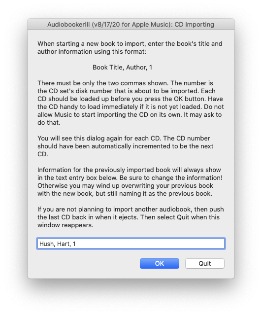
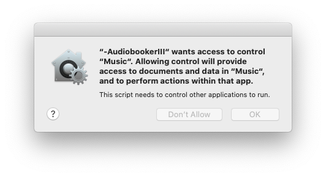

# AudiobookerIII/AudiobookerII

-   AudiobookerIII is a utility for **Apple Music** on Apple computers that imports audio book CDs for listening on an iPhone, iPad or iPod. On older Apple computers having **Apple iTunes** AudiobookerII is the Audiobooker version to use. AudiobookerII is essentially the same as AudiobookerIII. The former 'tells' **iTunes** what to do while the latter 'tells' **Music** what to do.
-   Audiobooker will consistently, without error, easily and correctly prepare public library borrowed CD audio books on a weekly basis for iPod and later iPhone listening.
-   AudiobookerIII and AudiobookerII are revisions to the original 4/7/2003 Audiobooker by David Mundie that was posted by Doug Adams at Doug's AppleScripts for **Apple iTunes**. AudiobookerII came about ten years after Audiobooker's last posted version. Seven years later Apple's **iTunes** name change to **Music** necessitated AudiobookerIII.  
### So exactly what does AudiobookerIII (AudibookerII) do?
-   Audiobooker creates a **playlist** containing all the audio book's CD collection content. The **playlist** audio tracks are appropriately named, properly sequenced and their meta data set for book listening. After you have typed in the book title and author the only thing you do next is load the correct next CDs. Audiobooker tells you which next CD number you should load.
-   The audio book playlist "tracks" will be named in a sensible manner so you can understand what they are and where you are in the audio book as you listen. If you have ever manually loaded audio book CDs using conventional means you know the CDs track names are typically useless too numerous to manually edit.

### How To Install AudiobookerIII (AudibookerII)

AudiobookerIII (AudibookerII) is a "run only" Applescript "bundle" file that directs **Apple Music**, in the case of AudiobookerIII, or that directs **Apple iTunes**, in the case of AudiobookerII. The respective Applescript files are named **~AudiobookerIII** and **~AudiobookerII**. Applescript files are add-in programs that can control Apple programs.

You actually do not have to "install" the AudiobookerIII or AudiobookerII Applescripts. They can run by themselves, but it makes sense to install them because they are used only in context with **Apple Music** or **Apple iTunes**. Once "installed" you will see them in the **Apple Music** and **Apple iTunes** menu interfaces.

Install the Applescript bundle by placing the correct bundle file into the **Music** **Scripts** folder or the **iTunes** **Scripts** folder. These **Scripts** folders are in your **user** **Library** folder. On newer computers having **Music** instead of **iTunes** you probably need to create the **Music** **Scripts** folder. The **Library** folder is normally hidden. An automatic installer has not been made, so you will need to closely follow these instructions.

#### Download: **[AudiobookerIII_II.zip](TheDownload/AudiobookerIII_II.zip)**

After downloading your system might have automatically extracted AudiobookerIII and AudiobookerII from the zip file's contents. The extracted results should be the application "bundle" files named **~AudiobookerIII** and **~AudiobookerII**. If extracting the zip file contents did not happen automatically then double clicking the downloaded zip file usually extracts a zip file's contents. On some older systems the Applescript files might appear as **~AudiobookerIII.app** and **~AudiobookerII.app**.

#### Follow these steps for installing AudiobookerIII (newer Mac OS X with Apple Music):

-   Quit the **Music** application if it happens to be running.
-   Locate your home **Library** folder. The **Library** folder is normally hidden on Macs. Select the **Go** at the **Finder** top menu. Do that again while also pressing the **option** key on your keyboard. _( **option** key is between **control** and **command** to the left of the keyboard space bar.)_ You will see **Library** added to the list of places to go. Select **Library**. The **Finder** will open that **Library** folder.
-   In the library folder locate and open the **Music** folder. Create that folder if it did not exist.
-   Inside this **Music** folder, create a new folder named **Scripts** if one does not exist. There might already be a **Scripts** folder there. Older computers that were upgraded from previous Apple OS systems that did have iTunes could have a leftover **iTunes/Scripts** folder. That is **not** the folder you are looking for when installing for **Apple Music**.
-   Place the script file named **-AudiobookerIII** in the newly created Scripts folder. By the way, the tilde "~" character in the name **~AudiobookerIII** makes that script show up at the top of the available scripts list. 
-   Delete the **-AudiobookerII** file that was also extracted from the download. It is for **Apple iTunes** and will not work unless you have **iTunes**.
-   Launch **Music**. A **Music** Script menu  item displaying the script collection will now be available in the top menu bar. You should see **~AudiobookerIII** in the  pull down menu.

#### Follow these steps for installing AudiobookerII (Mac OS X with Apple iTunes):

-   Quit the **iTunes** application if it happens to be running.
-   Locate your home **Library** folder. The **Library** folder is hidden on newer Macs. Select the **Go** at the **Finder** top menu. Do that again while also pressing the **option** key on your keyboard. _( **option** key is between **control** and **command** to the left of the keyboard space bar.)_ You will see **Library** added to the list of places to go. Select **Library**. The **Finder** will open that **Library** folder.
-   In the library folder locate and open the **iTunes** folder. Create that folder if it does not exist.
-   Inside this **iTunes** folder, create a new folder named **Scripts** if one does not exist. There might already be a **Scripts** folder there.
-   Place the script file named **~AudiobookerII** in the newly created Scripts folder. By the way, the tilde "~" character in the name **-AudiobookerII** makes that script show up at the top of the available scripts list. Delete the **-AudiobookerIII** file. It is for **Apple Music**.
-   Launch **iTunes**. An **iTunes** Script menu  item displaying the script collection will now be available in the menu bar. You should see **~AudiobookerII** in the  pull down menu.

## Using AudiobookerIII (same for AudiobookerII)

#### Remember

-   First make sure to have the audio book CDs readily available to load in the proper order starting from the first CD and ending with the last CD. Handling the CDs is the only repetitive task Audiobooker does not do for you. Adopting an organized task flow is much easier than fumbling through a CD stack.
-   **Only Follow Audiobooker instructions and prompt.** Dismiss or Cancel all instructions from **iTunes** or the **Finder** that might also pop up. All Audiobooker's instructions are easily recognized as coming from Audiobooker.

-   On newer OS X systems you will see a one time grant permissions dialog. Do grant the permission.

#### The Typical Use Flow

-   Have the CDs ready in order from first to last.
-   Start **Apple Music** or **Apple iTunes**.
-   Select **~AudiobookerIII (AudiobookerII)** from the Script menu .
-   The AudiobookerIII (AudiobookerII) CD Importing dialog should show.
-   Enter the book's title, the book's author and the number 1 in the entry field. Follow the entry format described in the AudiobookerIII (AudiobookerII) dialog. The number 1 is for the audio book's CD number. You enter this audio book information only once. The CD number is incremented for you every time you see this dialog when AudiobookerIII (AudiobookerII) is expecting the next CD to be loaded.
-   Press the **OK** button and immediately insert the number 1 CD into the optical drive.
-   AudiobookerII will be expecting **Apple Music** or **Apple iTunes** to see an audio CD being recognized by the computer. The computer has not yet informed **Apple Music** or **Apple iTunes** about the CD if you hear AudiobookerII asking for a CD even though you have just inserted it.
-   **Apple Music** or **Apple iTunes** will show all the CD's original track names. You will then see the tracks renamed according to the Book,Author and CD number. 
-   **Apple Music** or **Apple iTunes** might also show a dialog asking to use information it obtained from the internet regarding the CD. _**Dismiss (Cancel) that dialog. It is not an Audiobooker instruction. The only importing dialog you should ever respond to is the Audiobooker CD Importing dialog.**_
-   **Apple Music** or **Apple iTunes** will import all the tracks. **Apple Music** or **Apple iTunes** ejects the CD when it is finished importing the tracks on that CD.
-   Remove the ejected CD and insert the next CD. You may hear, "Waiting for the next CD.", if you wait too long to insert the next CD.
-   Audiobooker will show again the CD Importing dialog, but this time the CD number in the text entry field will have been automatically updated for you. Refer to that number to tell you what CD number to insert when you realize you have forgotten where you are in the process.
-   Press the OK button.
-   Repeat this process for all the CDs, **but after the last CD is ejected do this next step to end the process.**
-   Reinsert the last CD. The Audiobooker dialog will show again ready for a next non-existing CD. Press the **Quit** button in the CD Importing dialog. The CD will eject and Audiobooker closes out.

#### Imported Audio books Are Playlists

-   Audiobooker creates a playlist for each imported audio book CD set. The playlist names will start with the text "-ABk" so that they will be more distinguishable in the **Apple Music** or **Apple iTunes** playlist lists and so that they naturally group.

#### A Note For The Next Time You Use Audiobooker

-   **Make sure to update the Book,Author,CD number entry!** Audiobooker cannot read the CD to figure out the audio book's name, author etc. The information you see in the entry field is for your last read audio book. Forgetting to update the information will screw up your last imported audio book.

#### The original Audiobooker's information by David Mundie:

Audiobooks have several characteristics that make ripping them different from ripping music CD's. For one thing, most audiobooks are not in CCDB, so that their metadata must be entered by hand. For another, they consist of multiple CD's where the order of the tracks is crucial, and where the track names should usually be generated automatically based on album name, CD number, and track number - it is pretty confusing to have all the first tracks in all the CD's of an audiobook be named "Track 1".

The Audiobooker script provides a convenient interface for ripping audiobooks. It shows the user the current book name, author name, and CD number, and allows that information to be corrected. For example, it might prompt for "War and Peace, Tolstoy, 1". It then imports multiple CD's, placing them all in a playlist named for the book, and numbering the tracks intelligently, using the first word of the title plus the CD and track number. In the example, it will create a playlist named "War and Peace", and name the tracks "WarandPeace-01-01", "WarWarandPeace-01-02", etc. This style of track name facilitates listening to the audiobook on an iPod.

As each CD is finished, the script waits for the user to insert another one before proceeding. The status of the script is stored in a file in the **iTunes** folder of the user's Application Support folder.

The script illustrates a number of useful techniques: using Unix "mkdir -p" for easy creation of directories (this is quite painful in Applescript itself); waiting for disk insertion; and detecting the Audio CD playlist

### Revisions to the original Audiobooker:

-   Reversed book information order to title,author.
-   Added space trimming function
-   Changed the base track names to be built from the book title compressed by removing spaces, removing the words 'The' and 'Of' instead of using the first word in the title.
-   Added **iTunes** track settings: Spoken Word equalizer, save location and skip shuffle.
-   Added information to the input dialog.
-   Changed playlist name to start with "-ABk " as an identifier.
-   Added some flow control.
-   Changes iTunes application references to Music application references.

### Note

-   This script must be exported as an Application (using Apple’s Applescript Editor) to avoid a benign timeout error that occurs right after the user input dialog.

-   AKSeidel 3/29/2014 , 10/31/2015, 01/26/2016, 08/17/2020
